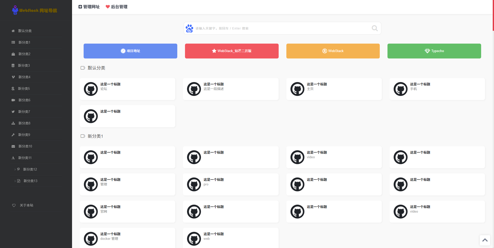
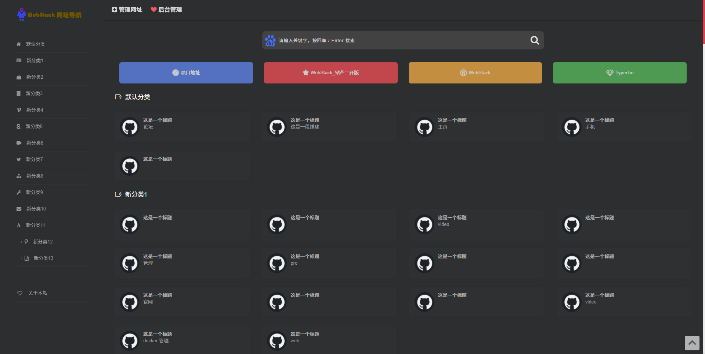
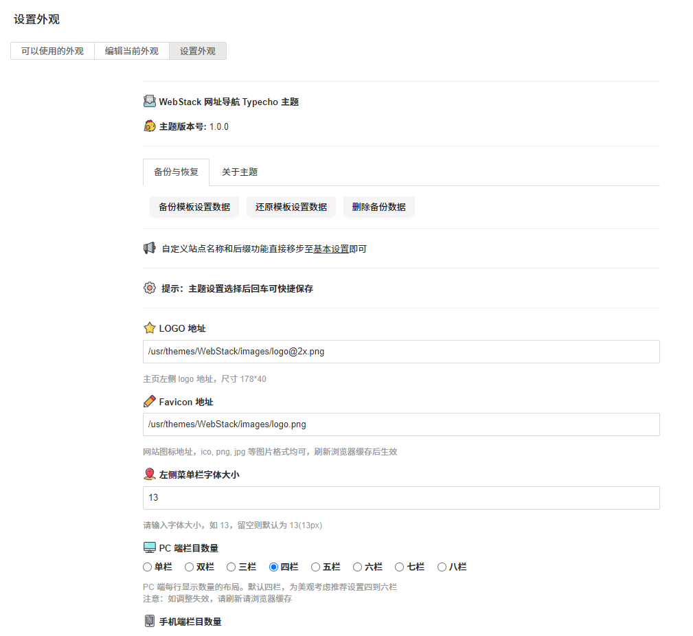
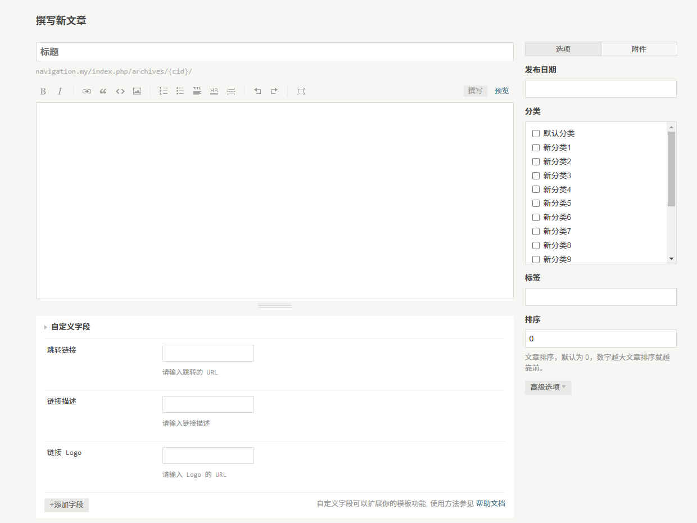

  

<h1 align="center">WebStack 网址导航 Typecho 主题</h1>

  
  

> Typecho 网址导航主题

## 简介

这是一个基于开源项目[WebStack](https://github.com/WebStackPage/WebStackPage.github.io)和[WebStack_钻芒二开版](https://github.com/wclk/WebStack_ZMKI)而制作的 Typecho 网址导航主题。

该项目主要是为了构建一个更适合~~我~~个人使用的网址导航站点，一切从简，以简约实用为原则做个简单纯粹的网址导航。

因此对比一些其他的网址导航程序，本导航程序可能也更适合搭建在像 NAS 这样的私人服务器上面去使用。

## 预览

### 主页预览

- 
- 

### 主题设置预览

- 

## 安装

1. 前往 [Typecho](https://typecho.org/download) 下载 Typecho 博客程序，参照安装环境要求及[安装文档](http://docs.typecho.org/install)，根据安装过程中的安装向导依次完成安装即可。
2. 前往 [Releases](https://github.com/LightAPIs/WebStackTypechoTheme/releases/latest) 下载主题文件压缩包，解压得到 `WebStack` 目录，将其上传至服务器 Typecho 主题目录 `/usr/themes/`。
3. 在浏览器里打开 Typecho 后台页面(默认：`/admin/index.php`)，点击"更换外观"进入外观设置页面，找到 WebStack Typecho Theme 主题并点击启用即可。此时回到博客首页便能看到导航主题效果了。

## 使用

### 添加分类

在后台的分类管理页面(默认：`/admin/manage-categories.php`)中可以添加或编辑分类，其对应导航页中左侧边栏里的菜单项，一般可以按照网址的类别来进行分类。

### 添加项目

在后台的文章管理页面(默认：`/admin/manage-posts.php`)中可以添加或编辑具体的网址导航项目。

其中可以填写的项目包括：

- 标题：即导航的标题
- 跳转链接：即导航到的网址
- 链接描述：可以补充一些关于该导航的信息描述
- 链接 Logo：即导航显示的图标地址，也可以自行在附件中上传图标并将地址填入
- 分类：选择导航网址的分类，不勾选则为默认分类
- *排序：同分类下的导航项目默认按照创建时间进行排序，可以通过填写此值使该导航项目排序更靠前*(**注：该功能需要另外安装 [EnablePostsOrder](https://github.com/LightAPIs/EnablePostsOrder) 插件才能实现**)

### 主题设置

在后台的外观设置页面(默认：`/admin/options-theme.php`)中可以调整设置关于本主题的其他功能。

## 插件

一些提供功能增强的 Typecho 插件：

- [LightAPIs/EnablePostsOrder](https://github.com/LightAPIs/EnablePostsOrder)：用于支持排序导航项目，推荐安装使用
- [LightAPIs/EncryptYourSite](https://github.com/LightAPIs/EncryptYourSite)：用于加密导航站点，若导航为私人使用且不想每个知道导航域名的都能看到站点内容，则可以安装使用该插件

## 相关项目

本项目的诞生离不开以下这些优秀的项目：

- [wclk/WebStack_ZMKI](https://github.com/wclk/WebStack_ZMKI)
- [WebStackPage/WebStackPage.github.io](https://github.com/WebStackPage/WebStackPage.github.io)

## License

[MIT](./LICENSE) license
